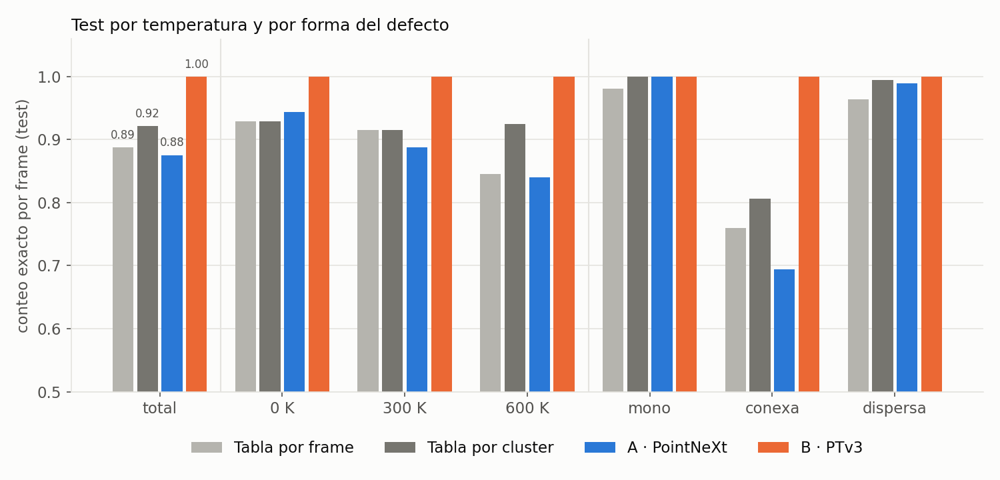
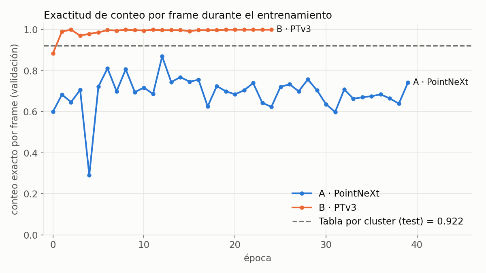

# ML-PYTORCH-CURSE

De redes convolucionales sobre imágenes a redes sobre nubes de puntos atómicas.

Este repositorio junta dos cosas:

- `ACurso-PYTORCH/`: el curso de PyTorch tal como vino (teoría en PDF y notebooks por sección).
- `doctorado/`: notebooks que toman lo del curso y lo llevan al problema de la tesis. El índice está en [`doctorado/README.md`](doctorado/README.md).

En este README va la teoría que conecta las dos partes. En el curso aprendimos a clasificar imágenes con redes convolucionales (MNIST, CIFAR-10, LeNet-5). En la tesis la entrada no es una imagen: es un conjunto de átomos con posiciones continuas en 3D. Abajo explico qué parte de la CNN sobrevive, qué parte hay que cambiar y por qué.

---

## 1. El problema físico

Tenemos cajas de Ni FCC simuladas con dinámica molecular, con entre 1 y 5 vacancias, a 0, 300 y 600 K. Queremos dos cosas:

- **contar** cuántas vacancias hay;
- **ubicar** dónde están;

y hacerlo **sin configuración de referencia**. Los métodos clásicos (Wigner-Seitz, CNA, PTM) comparan contra una red ideal o contra plantillas cristalinas. Eso funciona en un cristal limpio, pero falla en aleaciones de alta entropía muy deformadas o en nanopartículas irradiadas, que son los casos que interesan en la tesis. La idea es que una red aprenda a reconocer el defecto mirando solamente la geometría local de los átomos.

Wigner-Seitz sí se usa, pero **solo para generar las etiquetas de entrenamiento** sobre datos simulados donde la referencia existe. El modelo nunca la ve.

---

## 2. Por qué una imagen y una nube de puntos no son lo mismo

Una imagen es una función muestreada sobre una **grilla regular**: un tensor `[C, H, W]` donde cada píxel tiene un lugar fijo y vecinos fijos (arriba, abajo, izquierda, derecha). Toda la maquinaria de la CNN depende de esa grilla.

Una nube de átomos es un **conjunto** $X = \{(\mathbf{p}_i, \mathbf{f}_i)\}_{i=1}^{N}$, con $\mathbf{p}_i \in \mathbb{R}^3$ la posición y $\mathbf{f}_i$ los rasgos (coordinación, tipo de punto, etc.). Las diferencias que importan son estas:

| Propiedad | Imagen | Nube de átomos |
|---|---|---|
| Soporte | grilla discreta y regular | posiciones continuas, irregulares |
| Orden | el píxel (i, j) es siempre el mismo | los átomos no tienen orden: permutarlos no cambia el sistema |
| Tamaño | fijo (28×28, 32×32) | variable: cada parche tiene distinta cantidad de átomos |
| Vecindad | implícita en la grilla | hay que calcularla (radio o k vecinos más cercanos) |
| Densidad | uniforme | casi uniforme en el cristal, pero justamente **el defecto es un hueco** |
| Simetrías | traslación (la convolución es equivariante) | traslación, permutación, las 48 operaciones del grupo cúbico Oh, periodicidad de la caja |

Hay un punto que vuelve todo esto más sutil: **la señal que buscamos es la ausencia de un punto**. En una imagen, un objeto se ve por los píxeles que tiene. En la nube, una vacancia se ve por el átomo que falta y por cómo se relajan los vecinos alrededor del hueco.

### ¿Y si voxelizamos la nube y usamos una CNN 3D?

Es la opción más directa: armar una grilla 3D, poner en cada vóxel la densidad atómica y pasarle una `Conv3d`. Tiene tres problemas:

1. **Resolución.** Para no perder el desplazamiento de los vecinos de una vacancia (décimas de Å), el vóxel tiene que ser chico. Con una caja de 8³ celdas FCC (~28 Å de lado) y vóxeles de 0.2 Å quedan unos 2.8 millones de vóxeles, casi todos vacíos.
2. **Cuantización.** Dos átomos a 0.05 Å de distancia pueden caer en vóxeles distintos, y la red ve un salto discreto donde físicamente hay continuidad.
3. **Costo.** La memoria y el cómputo escalan con el volumen, no con la cantidad de átomos. No hay GPU disponible (ni en casa ni en el cluster simaf), así que esto pesa.

Por eso la alternativa es trabajar **directamente sobre los puntos**.

---

## 3. Qué hereda una red de nubes de la CNN

La buena noticia es que casi todas las ideas de la CNN tienen un equivalente. Lo que cambia es la implementación.

### 3.1 La convolución, reescrita para puntos

Una convolución 2D en el píxel $\mathbf{p}$ es

$$
y(\mathbf{p}) = \sum_{\boldsymbol{\delta} \in K} W_{\boldsymbol{\delta}} \, x(\mathbf{p} + \boldsymbol{\delta})
$$

donde $K$ es el conjunto de desplazamientos del kernel (por ejemplo, los 9 de un 3×3) y hay **un peso distinto $W_{\boldsymbol{\delta}}$ para cada desplazamiento**. Eso funciona porque los desplazamientos son un conjunto finito y fijo.

En una nube, los vecinos de un átomo $i$ están en desplazamientos continuos $\mathbf{p}_j - \mathbf{p}_i$ que cambian de átomo en átomo. No se puede tener una tabla de pesos indexada por desplazamiento. Entonces el peso se reemplaza por una **función aprendida del desplazamiento**, y la suma por una **agregación simétrica**:

$$
\mathbf{y}_i = \underset{j \in \mathcal{N}(i)}{\mathrm{AGG}} \; h_\theta\!\left(\mathbf{p}_j - \mathbf{p}_i,\; \mathbf{f}_j\right)
$$

- $\mathcal{N}(i)$ son los k vecinos más cercanos (o los que caen dentro de un radio). Cumple el papel de la **ventana del kernel**.
- $h_\theta$ es un MLP **compartido** por todos los puntos. Es el equivalente directo de **compartir pesos** en la CNN: el mismo filtro se aplica en todos lados.
- Usar $\mathbf{p}_j - \mathbf{p}_i$ en vez de $\mathbf{p}_j$ da **invariancia por traslación**, igual que en la convolución.
- AGG es `max` o `mean`. Al ser simétrica, el resultado no depende del orden de los vecinos, y eso da **invariancia por permutación**.

Esta operación es el bloque de *set abstraction* de PointNet++ y es la base de PointNeXt. También es un caso particular del *message passing* de una GNN, donde $\mathcal{N}(i)$ son las aristas del grafo (`edge_index` en el notebook 01).

### 3.2 Pooling → submuestreo de puntos

En la CNN, `MaxPool2d(2)` reduce 28×28 a 14×14: se queda con un representante por bloque de 2×2. En una nube no hay bloques, así que hay que elegir representantes:

- **Farthest Point Sampling (FPS)**, en PointNeXt: se elige un punto, después el más lejano a los ya elegidos, y así sucesivamente. Cubre el espacio de forma pareja, como lo haría una grilla.
- **Grid pooling**, en PTv3: se cuantizan las posiciones en una grilla y se fusionan los puntos que caen en la misma celda. Es lo más parecido al pooling de una imagen.

A cada representante se le agregan los rasgos de sus vecinos. El campo receptivo crece capa a capa, igual que en la CNN.

### 3.3 Flatten + Linear → pooling global

En la CNN del curso, después de las convoluciones viene `nn.Flatten()` y una `nn.Linear(32 * 27 * 27, 128)`. Eso **solo funciona porque el tamaño de entrada es fijo**: la capa lineal espera exactamente ese número de entradas y cada entrada tiene un lugar fijo.

En una nube, la cantidad de puntos varía y no tienen orden. Aplanar daría un vector de largo distinto en cada muestra, y además dependería del orden de los átomos. Se reemplaza por un **pooling global simétrico**:

$$
\mathbf{g} = \max_{i} \mathbf{y}_i \quad \text{o} \quad \mathbf{g} = \frac{1}{N} \sum_i \mathbf{y}_i
$$

Esto da un vector de tamaño fijo, invariante por permutación, que después va a un MLP de salida como en la CNN. El resultado teórico que respalda esta idea (Deep Sets, Zaheer et al. 2017) dice que toda función continua e invariante por permutación sobre conjuntos se puede escribir como $\rho\big(\sum_i \phi(\mathbf{x}_i)\big)$.

### 3.4 Padding → máscara de relleno

Para armar un batch, PyTorch necesita tensores rectangulares `[B, N, C]`, pero cada parche tiene un $N$ distinto. Se rellena hasta el $N$ máximo del batch, y hay que asegurarse de que el relleno **no cambie la respuesta**:

- el relleno son copias de puntos reales, así FPS nunca las elige antes que a un punto distinto;
- el kNN las excluye con una máscara;
- la media global solo promedia sobre puntos reales.

En la CNN, el `padding=2` de una convolución es parte del modelo. Acá el relleno es un artefacto del batching y no puede filtrarse a la salida. La condición que se exige es que **la predicción de un parche no dependa de con qué otros parches comparte el batch**.

### 3.5 Data augmentation → simetrías del cristal

En la Section 15 se aumentan imágenes con giros, recortes y espejados. Eso enseña invariancias que la red no tiene por construcción.

Para un cristal FCC alineado con los ejes, las transformaciones correctas son las **48 operaciones del grupo cúbico Oh** (24 rotaciones y sus composiciones con la inversión). Son simetrías **exactas** de la red: un parche rotado por una de ellas es un parche físicamente válido con la misma cantidad de vacancias. No se usan rotaciones arbitrarias porque sacarían al cristal de su orientación y producirían configuraciones que no aparecen en los datos.

Las redes de puntos usadas acá no son invariantes por rotación por construcción. Esa invariancia se aprende con el aumento, exactamente como en las imágenes.

### Resumen de la correspondencia

| CNN (curso) | Red de nubes (tesis) |
|---|---|
| `Conv2d`, kernel 3×3 o 5×5 | MLP compartido sobre kNN con coordenadas relativas |
| pesos compartidos | el mismo $h_\theta$ en todos los puntos |
| `MaxPool2d` / `AvgPool2d` | FPS (PointNeXt) o grid pooling (PTv3) |
| `Flatten` + `Linear` | max / media global con máscara |
| padding de la convolución | relleno del batch + máscara |
| giros y recortes (S15) | 48 operaciones de Oh |
| clasificación de la imagen | regresión de n por cluster (pipeline A) |
| segmentación por píxel (U-Net) | probabilidad de vacancia por sitio (pipeline B) |

---

## 4. Las dos arquitecturas

Las dos están reimplementadas en PyTorch puro, porque las versiones oficiales dependen de extensiones CUDA (pointops, spconv, flash-attn) y no hay GPU.

### 4.1 PointNeXt — el análogo de una CNN de clasificación

PointNeXt (Qian et al., NeurIPS 2022) es PointNet++ con el entrenamiento y el escalado modernizados. Su estructura se parece a LeNet-5:

1. una etapa de entrada que lleva cada átomo a un vector de rasgos;
2. varias etapas de *set abstraction* (FPS + kNN + MLP + max), cada una con menos puntos y más canales, como las capas conv + pool;
3. bloques residuales (InvResMLP) dentro de cada etapa, con la misma idea que una ResNet;
4. pooling global y un MLP final.

Acá la salida es **un escalar**: la cantidad de vacancias $n$ del cluster. Se entrena como regresión con Smooth-L1 y se redondea para contar. Es el mismo esquema que clasificar un dígito en MNIST, pero con salida continua en vez de 10 logits.

### 4.2 Point Transformer V3 — el análogo de una U-Net

Para **ubicar** las vacancias hace falta una predicción por punto, como en la segmentación semántica de imágenes. PTv3 (Wu et al., CVPR 2024) tiene una idea que lo acerca mucho al mundo de las imágenes: **serializa la nube**.

- Cada punto se cuantiza en una grilla y se ordena según una **curva de llenado del espacio** (z-order o Hilbert). Estas curvas recorren el espacio 3D de modo que puntos cercanos en la curva suelen estar cerca en el espacio.
- La nube pasa a ser una **secuencia 1D**. Se corta en parches de K puntos consecutivos y la atención se calcula dentro de cada parche. Es como una convolución sobre una secuencia, pero con pesos dinámicos (atención) en lugar de fijos.
- Entre bloques se rota el tipo de curva (z, Hilbert y sus versiones transpuestas), para que los bordes de parche caigan en lugares distintos y la información circule.
- Antes de cada atención va un **CPE** (codificación posicional condicional): una convolución puntual sobre kNN que inyecta la geometría local.
- El encoder submuestrea con grid pooling (stride 2) y el decoder vuelve a la resolución original con conexiones *skip*, igual que una U-Net.

### El truco de los sitios candidatos (pipeline B)

Una red de segmentación solo puede etiquetar puntos que existen, y **la vacancia es un punto que no existe**. Para resolverlo se agregan sitios candidatos a la nube:

1. cada átomo propone su propio sitio ideal y sus 12 primeros vecinos FCC (con $a = L/8$);
2. las propuestas a menos de 0.8 Å se funden en una sola;
3. se conservan las que tienen al menos 4 propuestas.

Alrededor de una vacancia, los 12 vecinos proponen el sitio vacío aunque ningún átomo lo ocupe. Así el hueco aparece como un punto candidato **sin usar ninguna red de referencia externa**: la red ideal se reconstruye a partir de los propios átomos.

PTv3 recibe átomos y candidatos juntos, marcados con un rasgo de tipo `[es_átomo, es_candidato]`. La salida es una probabilidad de vacancia por candidato (pérdida BCE, medida solo sobre candidatos). Es una segmentación binaria donde la "clase" de cada sitio es *ocupado* o *vacío*.

---

## 5. De una caja completa a muestras de entrenamiento

Una CNN recibe una imagen entera. Acá una caja tiene unos 2000 átomos y las vacancias son una parte mínima. Pasarle la caja entera sería como clasificar una foto de una ciudad para encontrar una moneda en el piso. Por eso se trabaja con **parches locales**, que hacen de "recortes" centrados en la zona de interés:

1. **Clusters.** Se buscan los átomos con coordinación menor a 12 (corte de 3.01 Å) y se agrupan en componentes conexas. Cada vacancia de Wigner-Seitz se asigna a un cluster. Algunos clusters tienen $n = 0$: son átomos con coordinación baja por agitación térmica, y sirven como negativos reales.
2. **Parche.** Se recorta una esfera de radio $R = \mathrm{clip}(r_{\max} + 4.5,\ 8,\ 14)$ Å alrededor del centro del cluster, con convención de imagen mínima para respetar la periodicidad.
3. **Normalización.** Las coordenadas se expresan relativas al centro y se dividen por 10. Cumple el mismo papel que `ToTensor()` llevando los píxeles de [0, 255] a [0, 1].
4. **Conteo por frame.** La cantidad total de vacancias de una caja es la suma de las predicciones de sus clusters.

El split train/val/test (70/15/15) se hace **por configuración**, no por frame. Frames de la misma simulación a distintos tiempos se parecen mucho, y separarlos al azar filtraría información del test al entrenamiento. Es el mismo cuidado que en la Section 10 con la validación cruzada, pero agrupada (`GroupKFold` en el notebook 03).

---

## 6. Cómo se evalúa

- **Por cluster:** exactitud y MAE del conteo.
- **Por frame:** proporción de cajas cuyo conteo total sale exacto, desglosada por temperatura y por forma del defecto (monovacancia, conexa, dispersa).
- **Pipeline B:** además precision, recall, F1, AUC y AP por candidato.

**Las líneas de base** son tablas de consulta que mapean "cantidad de átomos de baja coordinación" → "cantidad de vacancias", sin aprendizaje. Hay dos versiones:

- **por frame**: una sola tabla sobre la caja entera. Acierta el conteo exacto en el 0.887 de los frames de test;
- **por cluster**: la tabla se aplica a cada cluster y se suman los resultados. Acierta el **0.922**.

La vara a superar es la segunda, 0.922. Un modelo que no la supere no aporta nada. La parte difícil es la temperatura alta y la forma conexa: a 600 K la agitación térmica genera átomos de baja coordinación que no tienen nada que ver con vacancias, y los clusters de vacancias además migran.

---

## 7. Resultados

Corridas sobre la base completa (1500 configuraciones, 3500 frames), semilla 0, en CPU. Hay 5409, 1220 y 1112 parches en train, val y test. Las métricas y los logs están en [`resultados/runs/`](resultados/runs/) y las figuras se regeneran con `python resultados/graficas.py`.

| Conteo exacto por frame (test) | Total | 0 K | 300 K | 600 K | Mono | Conexa | Dispersa |
|---|---|---|---|---|---|---|---|
| Tabla por frame | 0.887 | 0.930 | 0.915 | 0.845 | 0.981 | 0.760 | 0.964 |
| Tabla por cluster | 0.922 | 0.930 | 0.915 | 0.925 | 1.000 | 0.806 | 0.995 |
| A · PointNeXt (0.99 M parámetros, 40 épocas) | 0.875 | 0.944 | 0.887 | 0.840 | 1.000 | 0.694 | 0.990 |
| B · PTv3 (1.88 M parámetros, 25 épocas) | 1.000 | 1.000 | 1.000 | 1.000 | 1.000 | 1.000 | 1.000 |

B además da, por candidato en test: precision 0.998, recall 0.999 y F1 0.998.

La línea punteada de la segunda figura es la línea de base medida en test. Sirve de referencia, pero las curvas son de validación.

### Lectura

**A no supera a las líneas de base.** PointNeXt queda por debajo de las dos tablas en el total y es peor justamente donde está la dificultad: la forma conexa (0.694 contra 0.806) y 600 K. La curva de validación es inestable (cae a 0.29 en la época 4 y oscila entre 0.6 y 0.87). El modelo guardado es el de la mejor época en validación. La regresión de un escalar por cluster, sin información explícita de dónde está cada hueco, no alcanza para separar vacancias contiguas.

**El 100 % de B hay que leerlo con cuidado.** Dos razones:

1. **La tarea puede ser casi trivial por construcción.** Un candidato vacío es, por definición, un sitio sin ningún átomo a menos de ~1 Å. Una regla tan simple como "¿hay un átomo encima de este candidato?" podría dar el mismo resultado. Que B llegue a 1.000 en la época 2 apunta en esa dirección. El número muestra que el pipeline de candidatos funciona, no que la red haya aprendido la geometría del defecto.
2. **Los candidatos usan una referencia débil.** Se reconstruyen con $a = L/8$, es decir, suponiendo el parámetro de red del cristal perfecto y la caja alineada con los ejes. En una HEA deformada o en una nanopartícula irradiada ese supuesto se rompe. En ese régimen está la motivación de la tesis.

Por eso este resultado vale como **validación sobre Ni FCC ideal**, no como validación del método.

### Próximos pasos

- Comparar B contra la regla trivial "candidato sin átomo a menos de 1 Å". Si la regla también da 1.000, B no está aportando nada.
- Repetir con varias semillas para medir la varianza. Hoy hay una sola corrida por modelo.
- Probar en configuraciones donde $a = L/8$ no vale: deformación, HEA, superficies libres.
- Para A, darle información local de los huecos (por ejemplo, los candidatos como rasgo) y ver si mejora en la forma conexa.

---

## 8. Recorrido sugerido

| Paso | Dónde | Qué se aprende |
|---|---|---|
| 1 | `ACurso-PYTORCH/Section 4` + `doctorado/01` | Tensores; una red FCC con vacancia como `pos`, `edge_index` y rasgos |
| 2 | `Section 7–9` + `doctorado/02` | Bucle de entrenamiento y regresión; MLP con descriptores locales como línea de base |
| 3 | `Section 10` + `doctorado/03` | Hiperparámetros, validación cruzada agrupada, checkpoints |
| 4 | `Section 11–12` | Convolución, pooling, flatten: lo que este README traduce a nubes |
| 5 | `Section 15` | Data augmentation y transfer learning: base para las simetrías de Oh |
| 6 | PointNeXt / PTv3 | Las redes de nubes descritas en las secciones 3 y 4 |

---

## Referencias

- Qi et al., *PointNet*, CVPR 2017.
- Qi et al., *PointNet++*, NeurIPS 2017.
- Zaheer et al., *Deep Sets*, NeurIPS 2017.
- Qian et al., *PointNeXt: Revisiting PointNet++ with Improved Training and Scaling Strategies*, NeurIPS 2022.
- Wu et al., *Point Transformer V3: Simpler, Faster, Stronger*, CVPR 2024.
- Ronneberger et al., *U-Net*, MICCAI 2015.
- LeCun et al., *Gradient-based learning applied to document recognition* (LeNet-5), Proc. IEEE 1998.
